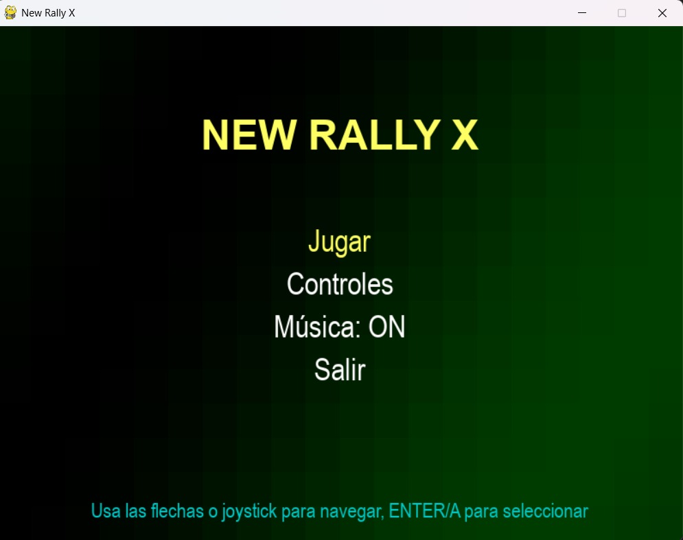

# Proyecto-parcial-IA

## Nombre
Wilbel Benitez
## Matrícula
22-SISN-2-064
## Proyecto
New Rally X

Un remaker del juego New Rally X con enemigos
que estan controlado con el arbol de comportamiento 
y el a*

# Caracteristicas
- el juego se puede manejar por teclado y por joystick
- enemigos generados con IA en el juego 
- el juego genara mapas en forma de laberito por cada nivel 
- tiene una mecanica de humo para desorientar a los enemigo 
- Sistema de audio y Efecto de sonido 

# Requistos 
python
pygame 

# Controles 
Teclado
- Flechas: Mover el auto

- ESPACIO: Soltar humo

- P: Pausa

- ESC: Menú principal

- M: Alternar música

- N: Siguiente canción

- +/-: Ajustar volumen

 Joystick

- Analógico izquierdo/D-Pad: Mover

- Botón A: Soltar humo

- Botón START: Pausa

- Botón B: Volver al menú

- Botón X: Alternar música

- Botón Y: Siguiente canción

- Gatillos: Ajustar volumen

## Instalación

 Clona el repositorio:
bash
git clone https://github.com/THEBICHOTE/New-Rally-X
cd new-rally-x